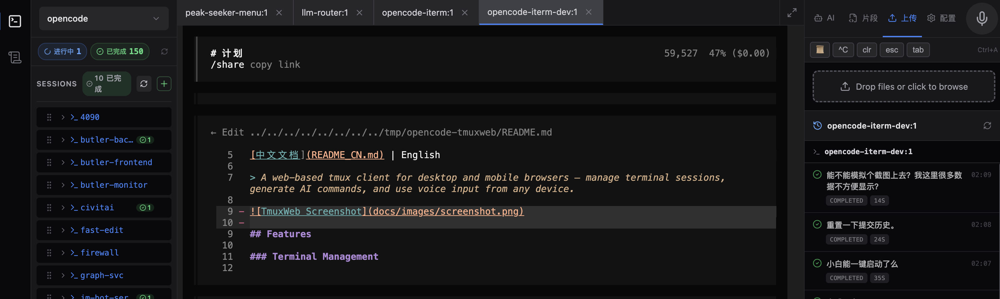
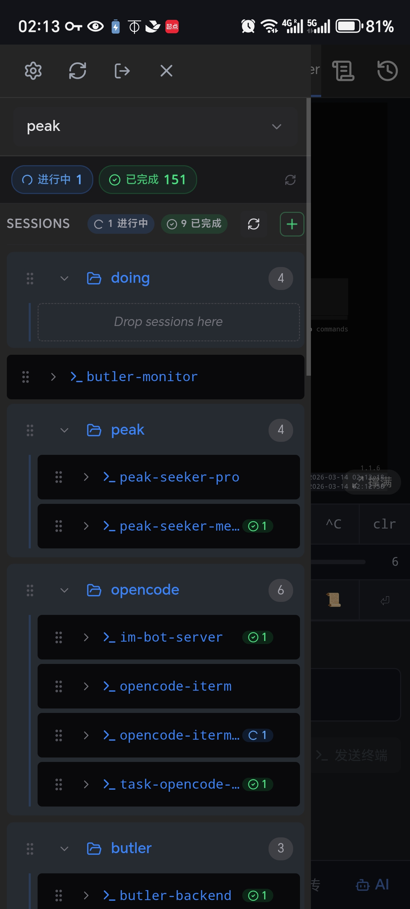
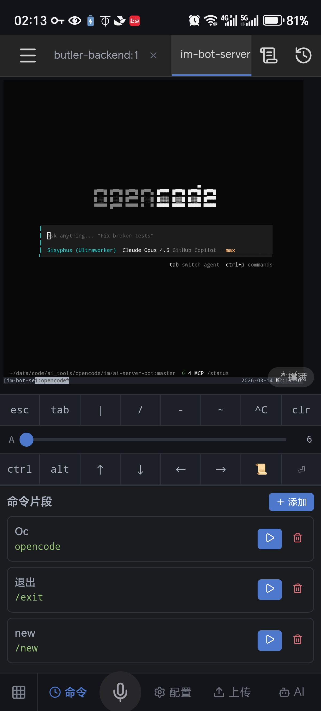
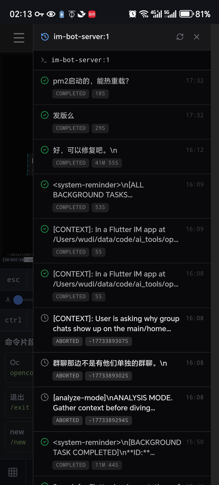

# TmuxWeb

[](LICENSE)

[中文文档](README_CN.md) | English

> A web-based tmux client for desktop and mobile browsers — manage terminal sessions, generate AI commands, and use voice input from any device.



## Features

### Terminal Management

- **Multi-session access** — browse and connect to any tmux session/window/pane from the browser
- **Multi-tab terminal** — open multiple panes in tabs, persist across page reloads
- **xterm.js rendering** — full terminal emulation with WebSocket PTY backend
- **Two terminal modes**:
  - `pty` (default) — one PTY per pane, full isolation
  - `controlmode` — single PTY via tmux control mode, lower resource usage
- **Auto-reconnect** — 2s retry on disconnect, press any key to reload on failure
- **HTTPS/WSS** — mkcert or self-signed certificates for secure access
- **Touch-friendly scrolling** — swipe up/down maps to tmux mouse wheel (requires `tmux set -g mouse on`)

### Desktop UI (`/`)

Three-column responsive layout: **sidebar** | **terminal tabs** | **toolbox**

**Sidebar — Explorer Mode:**
- Profile selector — switch between workspace profiles
- Session group manager — organize sessions into collapsible groups
- TmuxTree — hierarchical session → window → pane tree
- Pane status indicators (idle / in_progress / done / failed / waiting)
- New session/window creation with quick-directory picker
- Window rename via right-click
- Task stat badges — global task counts

**Sidebar — Imperial Study Mode (御书房):**
- Worker section — active AI agent workers with status badges
- Inbox section — unread notifications with body preview
- Activity section — recent events timeline
- Command input — dispatch tasks to orchestration backend or panes
- Run pipeline — track orchestration tasks in real time
- Assistant chat panel — streaming conversation with AI assistant
- Task detail modal — view intent, thinking chain, results, and event timeline
- **Floating mode** — detach as draggable/resizable popup window
- **Adjustable background opacity** — slider from fully transparent to opaque (text/icons stay visible)

**Terminal Tabs:**
- Open/close/reorder tabs
- Fullscreen toggle
- Tab state persisted in localStorage

**Toolbox Panel:**
- Quick keys: `Tab`, `Ctrl+C`, `Esc`, arrows, `Enter`, scroll mode
- Tmux prefix indicator
- **AI tab** — role selector, prompt input, voice button, one-tap send to terminal
- **Snippets tab** — save/load/delete frequently used commands
- **Upload tab** — file upload with copy-path-to-terminal
- **Config tab** — view pane OpenCode configuration
- Task history panel (per-pane)
- Keyboard shortcut: `Ctrl/Cmd + Shift + M` for voice input

### Mobile UI (`/m`)

Single-column layout optimized for touch:

- Hamburger drawer with TmuxTree and profile selector
- Full-screen terminal with touch gestures
- Imperial Study button (full-screen dashboard)
- Collapsible bottom toolbox:
  - Two-row quick keys: `esc`, `tab`, `|`, `/`, `-`, `~`, `^C`, `clr`, `ctrl`, `alt`, arrows, scroll, enter
  - Font size slider
  - Keyboard mode (expand quick keys to full width)
  - AI, Snippets, Config, Upload tabs
- Shake-to-record voice input
- Visual viewport handling for iOS keyboard

<p align="center">
  
  
  
</p>

### AI Command Generation

- **8 built-in roles**: CLI Expert, DevOps, Prompt Engineer, Frontend, Backend, UI/UX, API Architect, and more
- **Custom roles** — create/edit/delete via UI or API, stored in `custom_roles.json`
- **Per-role model configuration** — assign different LLM models to different roles
- **OpenAI-compatible API** — works with DeepSeek, OpenAI, Moonshot, DeerAPI, and any compatible provider
- One-tap send generated command to active terminal

### Voice Input

- Speech-to-text via **Xunfei (iFlytek)** WebSocket STT
- Hold-to-record with waveform visualization
- Supports Chinese and English
- Custom hotwords and replacements for domain-specific terms

### Task Tracking

- Automatic task lifecycle tracking (started → in_progress → completed/failed)
- Per-pane task history with detail view
- MySQL-backed persistence
- SSE (Server-Sent Events) for real-time status updates
- Task stat badges in sidebar
- Summary service integration (optional)

### Workspace Management

- **Profiles** — multiple workspace configurations, switch between projects
- **Session groups** — organize tmux sessions into collapsible categories
- **Quick directories** — configurable shortcuts for new window creation

### Orchestration Service Integration (御书房)

TmuxWeb provides a **generic orchestration docking standard** — connect any external task orchestration backend via a simple proxy configuration.

- **Proxy layer** — reverse-proxy any REST API through TmuxWeb (configurable host/port in `config_private.json`)
- **Worker dashboard** — view active AI agent workers from the orchestration backend
- **Inbox** — receive and display notifications from the orchestration service
- **Activity feed** — track recent events from connected services
- **Run pipeline** — monitor orchestration task execution in real time
- **Assistant chat** — streaming conversation with AI via the orchestration backend

> To integrate your own orchestration service, set the `butler` config with `{ "host": "...", "port": ... }` and implement the expected REST endpoints. See `server/routes/` for the proxy route definitions.

### OpenCode Integration

TmuxWeb has first-class integration with [OpenCode](https://github.com/nicepkg/opencode) (AI coding agent):

- **Plugin-based task tracking** — OpenCode plugin (`plugins/my-rules.js`) automatically reports task lifecycle events (`task_started` → `in_progress` → `completed` / `failed` / `waiting`) to TmuxWeb via API
- **Real-time pane status** — sidebar pane indicators update automatically as OpenCode agents work (idle 🔘 → in_progress 🟡 → done 🟢 → failed 🔴)
- **Per-pane task history** — every OpenCode conversation is recorded with user message, assistant response, timestamps, and status
- **SSE live updates** — task state changes are pushed to the browser in real time via Server-Sent Events
- **OpenCode config viewer** — view `opencode.json` and `oh-my-opencode.json` for any pane's project directory directly from the toolbox
- **Conversation & command logging** — log user/assistant messages and executed commands per task segment
- **AI task summaries** — generate summaries of completed tasks (optional external service)
- **Capabilities manifest** — self-describing API (`/api/capabilities`) for service discovery by orchestration tools
- **Custom rules injection** — plugin injects custom system prompt rules (e.g. fast-edit) into OpenCode sessions

#### Plugin Deployment

The plugin provides two functions: **task tracking** (reports AI conversation lifecycle to TmuxWeb) and **custom rules injection** (adds your rules to every AI session's system prompt).

**Step 1 — Create your local plugin:**

```bash
cd opencode-tmuxweb/TmuxWeb/plugins
cp my-rules.js.back my-rules.js        # create local copy (gitignored)
```

**Step 2 — Symlink into OpenCode plugins directory:**

```bash
mkdir -p ~/.config/opencode/plugins
ln -sf "$(pwd)/my-rules.js" ~/.config/opencode/plugins/my-rules.js
```

**Step 3 — Configure the port:**

Edit `my-rules.js` and set the `PORT` constant to match your TmuxWeb server port:

```javascript
const PORT = 8215;            // must match your server/config_private.json port
```

**Step 4 — (Optional) Enable task persistence:**

Task tracking requires MySQL. Add `db` config to `server/config_private.json`:

```json
{
  "db": {
    "host": "localhost",
    "port": 3306,
    "user": "root",
    "password": "your-password",
    "database": "tmuxweb"
  }
}
```

Without MySQL, the plugin still runs — task events return 503 silently, and OpenCode works normally.

**Step 5 — Add your own rules:**

Edit the `MY_RULES` section in `my-rules.js` to inject custom rules into every OpenCode session. The template includes `[FAST-EDIT]` as an example — add your own blocks below it:

```javascript
const MY_RULES = `<MY_RULES>
// ... existing rules ...

// ── Add your own rules below ──
// [MY-CUSTOM-RULE]
// When the user asks to do X, load skill("your-skill") first, then ...
</MY_RULES>`;
```

**Verify it works:**

1. Start TmuxWeb server
2. Open a tmux pane and launch OpenCode
3. Send any message — the sidebar pane indicator should turn 🟡 (in_progress)
4. When the AI finishes, it should turn 🟢 (done)

If nothing happens, check:
- `curl -sk https://localhost:8215/healthz` → should return `{"status":"ok","db":"ok"}`
- Symlink exists: `ls -la ~/.config/opencode/plugins/my-rules.js`
- Port matches between `my-rules.js` and your server config

#### How It Works

```
OpenCode session starts
  → chat.message hook fires in my-rules.js
  → POST /api/tasks/events {event: "task_started", pane_key, conversation_id}
  → TmuxWeb writes to ai_conversation table + broadcasts SSE
  → Sidebar pane indicator turns 🟡

OpenCode session ends (session.idle event)
  → event hook fires in my-rules.js
  → POST /api/tasks/events {event: "task_completed", conversation_id}
  → TmuxWeb updates record + broadcasts SSE
  → Sidebar pane indicator turns 🟢
```

The plugin identifies the current pane via `tmux display-message -p '#{session_name}/#{window_index}/#{pane_id}'` and generates a UUID for each conversation.

## Architecture

```
┌──────────────┐      ┌───────────────┐      ┌───────────┐
│  Browser     │◄────►│  Node.js      │◄────►│   tmux    │
│  (React SPA) │ WSS  │  Express + WS │ PTY  │  sessions │
└──────────────┘      └───────────────┘      └───────────┘
                            │    │
                    ┌───────┘    └────────┐
                    │                     │
              ┌─────┴─────┐        ┌─────┴─────┐
              │  LLM API  │        │   MySQL   │
              │ (OpenAI   │        │  (tasks,  │
              │ compatible)│        │  segments)│
              └───────────┘        └───────────┘
```

| Layer | Tech |
|-------|------|
| Frontend | React 18, TypeScript, Vite 5, xterm.js |
| Backend | Node.js, Express 4, WebSocket (ws), node-pty |
| Database | MySQL (mysql2/promise) |
| AI | OpenAI-compatible APIs (DeepSeek, GPT, etc.) |
| Voice | Xunfei WebSocket STT |
| Deploy | PM2, HTTPS (mkcert) |

## Quick Start

### Prerequisites

- macOS or Linux with tmux installed
- Node.js 18.x – 20.x (tested on v20.20.0)
- npm ≥ 8.x
- MySQL 5.7+ (optional — for task tracking persistence)
- tmux ≥ 3.0

> ⚠️ Node.js v22+ may have compatibility issues with node-pty. Use v20.x if you encounter errors.

### Install

```bash
git clone https://github.com/includewudi/opencode-tmuxweb.git
cd opencode-tmuxweb/TmuxWeb

# Install backend dependencies
npm install

# Install and build frontend
cd web && npm install && npm run build && cd ..
```

### Configure

Copy the default config and fill in your values:

```bash
cp server/config.json server/config_private.json
```

Edit `server/config_private.json`:

```jsonc
{
  "token": "your-secret-token",        // Required — used for auth
  "sessionSecret": "your-session-key", // Required — cookie signing

  // LLM (optional — for AI command generation)
  "llm": {
    "apiKey": "sk-xxx",
    "apiUrl": "https://api.deepseek.com/v1/chat/completions",
    "model": "deepseek-chat",
    "roles": {
      "cli": { "model": "gpt-4o" }     // Per-role override
    }
  },

  // Voice (optional — for speech-to-text)
  "xfyun": {
    "appId": "xxx",
    "apiKey": "xxx",
    "apiSecret": "xxx"
  },

  // Database (optional — for task tracking)
  "db": {
    "host": "localhost",
    "port": 3306,
    "user": "root",
    "password": "your-password",
    "database": "tmuxweb"
  },

  // Network
  "allowedOrigins": [
    "https://192.168.1.100:5215"        // Your LAN IP
  ]
}
```

> `config_private.json` is gitignored. The public `config.json` contains defaults and documentation.

### Database Setup (Optional)

Only needed if you want task tracking persistence:

```bash
mysql -u root -p
```

```sql
CREATE DATABASE tmuxweb CHARACTER SET utf8mb4 COLLATE utf8mb4_unicode_ci;
```

The server auto-creates tables on first start via `server/db/bootstrap.js`.

### SSL Certificates

Required for HTTPS access (especially from iOS devices).

**Option A: mkcert (recommended)**

```bash
brew install mkcert
mkcert -install
cd opencode-tmuxweb/TmuxWeb
mkcert -key-file key.pem -cert-file cert.pem localhost 127.0.0.1 $(ipconfig getifaddr en0)
```

Install CA on iPhone:
1. Start the server, then open `http://<your-ip>:8280` in Safari
2. Tap "Download CA Certificate"
3. Settings → Downloaded Profile → Install
4. Settings → General → About → Certificate Trust Settings → Enable full trust

**Option B: Self-signed**

```bash
openssl req -x509 -nodes -days 365 -newkey rsa:2048 \
  -keyout key.pem -out cert.pem -subj "/CN=localhost"
```

> Without certificates, the server runs in HTTP mode (no WSS, limited mobile support).

### Start

```bash
# Development
node server/index.js                    # Backend (port 8215)
cd web && npm run dev                   # Frontend (port 5215)

# Production (PM2)
pm2 start ecosystem.config.js
```

Open `https://<your-ip>:5215` in your browser.

### Remote Access via ZeroTier

For access without a public IP:

1. Install ZeroTier on server and mobile device
2. Join the same network
3. Add ZeroTier IP to `allowedOrigins` in `config_private.json`
4. Access via `http://<zerotier-ip>:5215`

## API Reference

All API routes require authentication (token via login or session cookie).

### Authentication
| Method | Endpoint | Description |
|--------|----------|-------------|
| POST | `/api/auth/login` | Login with token → HttpOnly session cookie |
| POST | `/api/auth/logout` | Clear session |

### Tmux Management
| Method | Endpoint | Description |
|--------|----------|-------------|
| GET | `/api/sessions` | List tmux sessions |
| POST | `/api/sessions` | Create new session |
| GET | `/api/panes` | List panes (with `?session=name`) |
| POST | `/api/windows` | Create new window |
| PUT | `/api/windows/:target/name` | Rename window |

### AI & Roles
| Method | Endpoint | Description |
|--------|----------|-------------|
| POST | `/api/ai/command` | Generate AI command `{prompt, role}` |
| GET | `/api/roles` | List all roles (built-in + custom) |
| POST | `/api/roles` | Create custom role |
| PUT | `/api/roles/:id` | Update custom role |
| DELETE | `/api/roles/:id` | Delete custom role |

### Snippets
| Method | Endpoint | Description |
|--------|----------|-------------|
| GET | `/api/snippets` | List saved command snippets |
| POST | `/api/snippets` | Save a command snippet |
| DELETE | `/api/snippets/:id` | Delete a snippet |

### Profiles & Groups
| Method | Endpoint | Description |
|--------|----------|-------------|
| GET | `/api/profiles` | List workspace profiles |
| POST | `/api/profiles` | Create profile |
| GET | `/api/groups` | List session groups |
| POST | `/api/groups` | Create/update groups |

### Tasks
| Method | Endpoint | Description |
|--------|----------|-------------|
| GET | `/api/tasks/events` | SSE stream for real-time task updates |
| POST | `/api/tasks/events` | Report task event |
| GET | `/api/tasks/stats` | Task statistics |
| GET | `/api/tasks/pane/:paneKey` | Task history for a pane |

### WebSocket
| Endpoint | Description |
|----------|-------------|
| `/ws?target=session:window.pane` | Terminal PTY connection |
| `/ws/speech` | Xunfei STT proxy |

### Other
| Method | Endpoint | Description |
|--------|----------|-------------|
| POST | `/api/upload` | File upload |
| GET | `/api/capabilities` | API capability manifest |
| GET | `/api/hotwords` | Voice hotwords & replacements |
| POST | `/api/segments` | Log conversation/command segments |
| GET | `/api/summaries/:paneKey` | Task summaries for a pane |

## Configuration Reference

All settings go in `server/config_private.json` (overrides `config.json`):

| Key | Type | Default | Description |
|-----|------|---------|-------------|
| `port` | number | `8215` | Backend API port |
| `bind` | string | `"0.0.0.0"` | Bind address |
| `token` | string | `""` | Auth token (required) |
| `sessionSecret` | string | `""` | Cookie session secret |
| `sessionMaxAgeDays` | number | `30` | Session cookie lifetime |
| `frontendPort` | number | `5215` | Frontend dev/preview port |
| `envName` | string | `"prod"` | Environment name (used in PM2 process names) |
| `terminalMode` | string | `"pty"` | `"pty"` or `"controlmode"` |
| `tmuxSocket` | string | `null` | Custom tmux socket path |
| `quickDirs` | array | `[...]` | Quick directories for new windows |
| `allowedOrigins` | array | `[...]` | CORS allowed origins |
| `llm` | object | `{}` | LLM configuration (apiKey, apiUrl, model, roles) |
| `xfyun` | object | `{}` | Xunfei STT credentials (appId, apiKey, apiSecret) |
| `db` | object | `{}` | MySQL connection (host, port, user, password, database) |
| `butler` | object | `{}` | Orchestration service proxy (host, port) |
| `summaryServiceUrl` | string | `""` | External summary service URL |

## Project Structure

```
TmuxWeb/
├── server/
│   ├── index.js              # Express + WebSocket entry point
│   ├── config.json           # Default config (tracked)
│   ├── config_private.json   # Your config (gitignored)
│   ├── routes/               # API route handlers
│   ├── middleware/            # Auth middleware
│   ├── services/
│   │   ├── terminal.js       # PTY terminal service
│   │   ├── terminal-controlmode.js  # Control mode terminal
│   │   └── speech.js         # Xunfei STT proxy
│   └── db/
│       ├── pool.js           # MySQL connection pool
│       ├── bootstrap.js      # Auto table creation
│       └── init.sql          # Schema definitions
├── web/
│   ├── src/
│   │   ├── main.tsx          # Router (/ → desktop, /m → mobile)
│   │   ├── desktop/          # Desktop app & components
│   │   ├── mobile/           # Mobile app & components
│   │   ├── shared/           # Shared components (TmuxTree, Imperial Study, etc.)
│   │   ├── hooks/            # Custom React hooks
│   │   ├── utils/            # Helpers (auth, platform, API)
│   │   ├── styles/           # CSS stylesheets
│   │   └── types.ts          # TypeScript type definitions
│   ├── vite.config.ts        # Vite configuration
│   └── package.json
├── ecosystem.config.js       # PM2 process configuration
├── LICENSE                   # MIT License
└── CONTRIBUTING.md           # Contribution guidelines
```

## Troubleshooting

See [skills/troubleshooting.md](skills/troubleshooting.md) for solutions to common issues:

- PTY resource exhaustion (macOS 511 limit)
- Port conflicts and startup errors
- WebSocket connection problems
- iOS-specific issues
- Database configuration
- OpenCode plugin setup (fast-edit, task tracking)

## Contributing

We welcome bug reports and feature suggestions! Please see [CONTRIBUTING.md](CONTRIBUTING.md) for guidelines.

> **Note:** We are not accepting pull requests at this time.

## License

[MIT](LICENSE) © Wu Di
